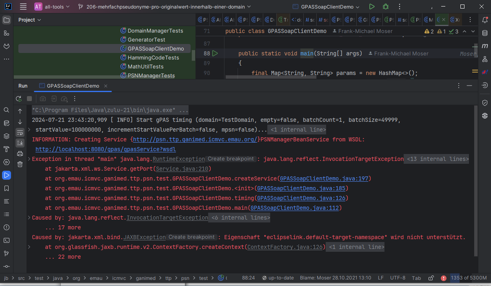
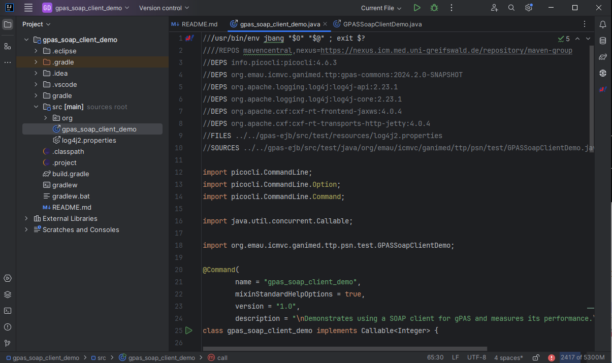
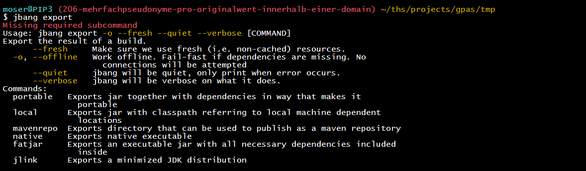
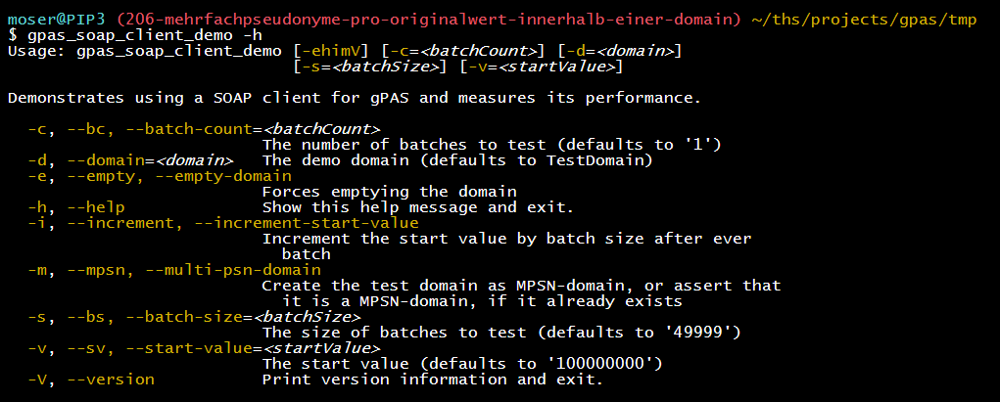
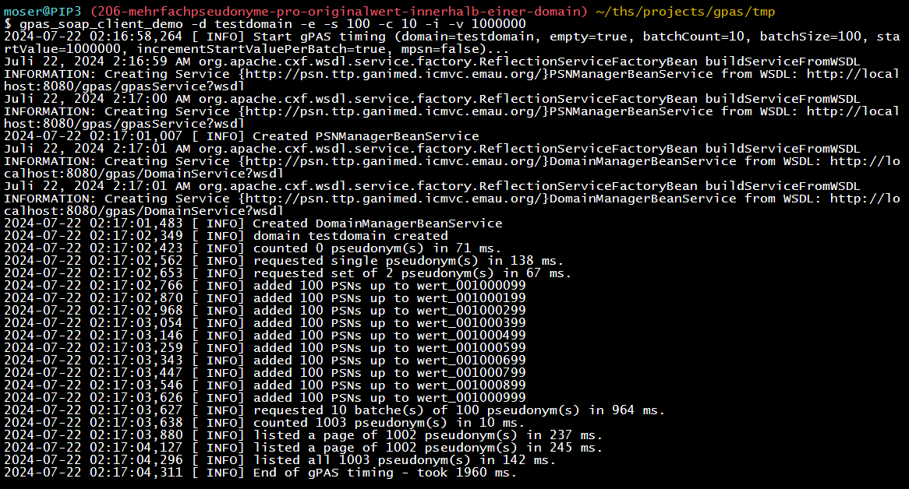

# JBang und unser gPAS-SOAP-Client-Demo

## Motivation

Schnell und einfach **in Java** mit der SOAP-API des gPAS rumspielen...

### Die Verheißung

[GPASSoapClientDemo.java](https://git.icm.med.uni-greifswald.de/ths/gpas/-/blob/8d97f59cf23478ee15c9e5012e7ba38d53a57da8/gpas-ejb/src/test/java/org/emau/icmvc/ganimed/ttp/psn/test/GPASSoapClientDemo.java)

- existiert schon als `org/emau/icmvc/ganimed/ttp/psn/test/GPASSoapClientDemo.java` in `gpas-ejb/test` 
- ausführbare Klasse (mit `main`) zum **Scratch-Testen der SOAP-Schnittstelle**
- gleichzeitig **Demo für die Benutzung SOAP-Schnittstelle** des gPAS mit `gpas-commons`-API und [`Apache CXF`](https://cxf.apache.org/)

Cool, also nix wie ran da... aber leider **<span style="color:red">Bang!!!</span>**

### Die Enttäuschung



```java
jakarta.xml.bind.JAXBException: 
  Eigenschaft "eclipselink.default-target-namespace" wird nicht unterstützt.
	at org.glassfish.jaxb.runtime.v2.ContextFactory.createContext(ContextFactory.java:126)
```

- **Ursache**: [Apache-CXF-Jira: Update CXF's JAXB handling to detect/support Eclipselink Moxy](https://issues.apache.org/jira/browse/CXF-5131) (2013-2023...)
- **Kurz zusammengefasst**: zu viele konkurrierende Abhängigkeiten
- **Move to `gpas-commons`?**: keine Option, da wir dort als dep kein `apache.cxf` wollen (oder vielleicht doch, wenn es nur eine test-dep ist...?)

Aber da war doch noch was... **<span style="color:green">JBang!!!</span>**

### Der Ausweg

[JBang](https://www.jbang.dev/)

> Lets Students, Educators and Professional Developers create, edit and run 
> **self-contained source-only Java programs** with unprecedented ease.

Ein JBang-Wrapper-Skript

- ermöglicht, `GPASSoapClientDemo` außerhalb seines Maven-Projektes auszuführen
- minimiert damit dessen notwendige Abhängigkeiten und
- ermöglicht sehr einfach ein optionsreiches Commandline-Interface zu ergänzen

## [JBang](https://www.jbang.dev/)

> Do you **like Java but use python**, groovy, kotlin or similar languages **for scripts**, 
> experimentation and exploration?
>
> Ever wanted to just be able to run java from anywhere without any or very minimal setup?
> Ever tried out Java 11+ support for **running .java files directly in your shell** 
> but felt it was a bit too cumbersome?

### Supereinfache Installation

Sieht kompliziert aus, ist aber wirklich einfach:

**Bash** (Linux/OSX/Windows/AIX):
```sh
curl -Ls https://sh.jbang.dev | bash -s - app setup
```
**Powershell** (Windows)
```powershell
iex "& { $(iwr -useb https://ps.jbang.dev) } app setup"
```
**Done.** (...oder ['zig andere Möglichkeiten](https://www.jbang.dev/documentation/guide/latest/installation.html))

### `jbang config list`

```sh
$ jbang config list
edit.open = idea
format = text
init.template = hello
jdkproviders = current,default,javahome,path,jbang
```

- wer mit `IntelliJ IDEA` arbeitet, will `edit.open = idea` in der Config (`~/.jbang/jbang.properties`)

### `jbang init -t cli`

```sh
$ jbang init -t cli gpas_soap_client_demo.java
[jbang] File initialized. You can now run it with 'jbang gpas_soap_client_demo.java' 
or edit it using 'jbang edit --open=[editor] gpas_soap_client_demo.java' where [editor] 
is your editor or IDE, e.g. 'idea'. If your IDE supports JBang, 
you can edit the directory instead: 
'jbang edit . 'gpas_soap_client_demo.java. See https://jbang.dev/ide
```

...initialisiert eine Java-Datei mit dem Template CLI:

```java
///usr/bin/env jbang "$0" "$@" ; exit $?
//DEPS info.picocli:picocli:4.6.3

import picocli.CommandLine;
import picocli.CommandLine.Command;
import picocli.CommandLine.Parameters;

import java.util.concurrent.Callable;

@Command(
  name = "gpas_soap_client_demo", 
  mixinStandardHelpOptions = true, 
  version = "gpas_soap_client_demo 0.1",
  description = "gpas_soap_client_demo made with jbang")
class gpas_soap_client_demo implements Callable<Integer> {

    @Parameters(
      index = "0", 
      description = "The greeting to print", 
      defaultValue = "World!")
    private String greeting;

    public static void main(String... args) {
        int exitCode = new CommandLine(new gpas_soap_client_demo()).execute(args);
        System.exit(exitCode);
    }

    @Override
    public Integer call() throws Exception { // your business logic goes here...
        System.out.println("Hello " + greeting);
        return 0;
    }
}
```

#### Magic running

```sh
///usr/bin/env jbang "$0" "$@" ; exit $?
```

als erste Zeile des Skripts, das `/usr/bin/env jbang` mit diesem Skript als erstem Parameter und allen weiteren Argumenten als weitere Parameter ausführt. Darum geht hier nun:

```sh
gpas_soap_client_demo.java
```

#### Magic deps

```mvn
//DEPS info.picocli:picocli:4.6.3
```

### `jbang app install`

```sh
jbang app install gpas_soap_client_demo.java
```

Jetzt geht **von überall** sogar

```sh
gpas_soap_client_demo
```

### `jbang edit -b`

Erstellt hinter den Kulissen mit Hilfe von Symlinks ein "fully-flavoured" Maven-basiertes Projekt (in `.jbang/cache/projects/`):



#### DEPS (Maven-Dependencies)

Klassische Maven-Deps inkl. lokale Snapshots aus dem Nexus:

```mvn
//DEPS info.picocli:picocli:4.6.3
//DEPS org.emau.icmvc.ganimed.ttp:gpas-commons:2024.2.0-SNAPSHOT
//DEPS org.apache.logging.log4j:log4j-api:2.23.1
//DEPS org.apache.logging.log4j:log4j-core:2.23.1
//DEPS org.apache.cxf:cxf-rt-frontend-jaxws:4.0.4
//DEPS org.apache.cxf:cxf-rt-transports-http-jetty:4.0.4
```

#### FILES (Resources)

Beliebige Dateien aus dem Filesystem als Resources:

```
//FILES ../../gpas-ejb/src/test/resources/log4j2.properties
```

#### SOURCES (Java-Source-Files)

Beliebige Dateien aus dem Filesystem als weitere Java-Sources (entscheidend ist die `package`-Deklaration):

```
//SOURCES ../../gpas-ejb/src/test/java/org/emau/icmvc/ganimed/ttp/psn/test/GPASSoapClientDemo.java
```

Keine einzige Zeile musste angepasst werden, um `GPASSoapClientDemo.java` ins Skript einzubinden.

### `jbang export`



## [`gpas_soap_client_demo`](https://git.icm.med.uni-greifswald.de/ths/gpas/-/blob/8d97f59cf23478ee15c9e5012e7ba38d53a57da8/deploy/test/gpas_soap_client_demo.java)

Nun verwandelt vom Hello-World-Demo zum [gpas_soap_client_demo](https://git.icm.med.uni-greifswald.de/ths/gpas/-/blob/8d97f59cf23478ee15c9e5012e7ba38d53a57da8/deploy/test/gpas_soap_client_demo.java), dem CLI für das [GPASSoapClientDemo.java](https://git.icm.med.uni-greifswald.de/ths/gpas/-/blob/8d97f59cf23478ee15c9e5012e7ba38d53a57da8/gpas-ejb/src/test/java/org/emau/icmvc/ganimed/ttp/psn/test/GPASSoapClientDemo.java):

```java
///usr/bin/env jbang "$0" "$@" ; exit $?
////REPOS mavencentral,nexus=https://nexus.icm.med.uni-greifswald.de/repository/maven-group
//DEPS info.picocli:picocli:4.6.3
//DEPS org.emau.icmvc.ganimed.ttp:gpas-commons:2024.2.0-SNAPSHOT
//DEPS org.apache.logging.log4j:log4j-api:2.23.1
//DEPS org.apache.logging.log4j:log4j-core:2.23.1
//DEPS org.apache.cxf:cxf-rt-frontend-jaxws:4.0.4
//DEPS org.apache.cxf:cxf-rt-transports-http-jetty:4.0.4
//FILES ../../gpas-ejb/src/test/resources/log4j2.properties
//SOURCES ../../gpas-ejb/src/test/java/org/emau/icmvc/ganimed/ttp/psn/test/GPASSoapClientDemo.java

import picocli.CommandLine;
import picocli.CommandLine.Option;
import picocli.CommandLine.Command;

import java.util.concurrent.Callable;

import org.emau.icmvc.ganimed.ttp.psn.test.GPASSoapClientDemo;

@Command(
        name = "gpas_soap_client_demo",
        mixinStandardHelpOptions = true,
        version = "1.0",
        description = "\nDemonstrates using a SOAP client for gPAS and measures its performance.\n")
class gpas_soap_client_demo implements Callable<Integer> {

    @Option(names = {"-d", "--domain"},
            description = "The demo domain (defaults to " + GPASSoapClientDemo.DEFAULT_DOMAIN_NAME + ")",
            defaultValue = GPASSoapClientDemo.DEFAULT_DOMAIN_NAME)
    private String domain;

    @Option(names = {"-e", "--empty", "--empty-domain"},
            description = "Forces emptying the domain")
    private boolean empty;

    @Option(names = {"-c", "--bc", "--batch-count"},
            description = "The number of batches to test (defaults to '" + GPASSoapClientDemo.DEFAULT_BATCH_COUNT + "')",
            defaultValue = GPASSoapClientDemo.DEFAULT_BATCH_COUNT + "")
    private int batchCount;

    @Option(names = {"-s", "--bs", "--batch-size"},
            description = "The size of batches to test (defaults to '" + GPASSoapClientDemo.DEFAULT_BATCH_SIZE + "')" ,
            defaultValue = GPASSoapClientDemo.DEFAULT_BATCH_SIZE + "")
    private int batchSize;

    @Option(names = {"-v", "--sv", "--start-value"},
            description = "The start value (defaults to '" + GPASSoapClientDemo.DEFAULT_START_VALUE + "')" ,
            defaultValue = GPASSoapClientDemo.DEFAULT_START_VALUE + "")
    private int startValue;

    @Option(names = {"-i", "--increment", "--increment-start-value"},
            description = "Increment the start value by batch size after ever batch")
    private boolean incrementStartValue;

    @Option(names = {"-m", "--mpsn", "--multi-psn-domain"},
            description = "Create the test domain as MPSN-domain, or assert that it is a MPSN-domain, if it already exists")
    private boolean multiPsnDomain;

    public static void main(String... args) {
        System.exit(new CommandLine(new gpas_soap_client_demo()).execute(args));
    }

    @Override
    public Integer call() throws Exception {
        GPASSoapClientDemo.timing(domain, empty, batchCount, batchSize, startValue, incrementStartValue, multiPsnDomain);
        return 0;
    }
}
```


